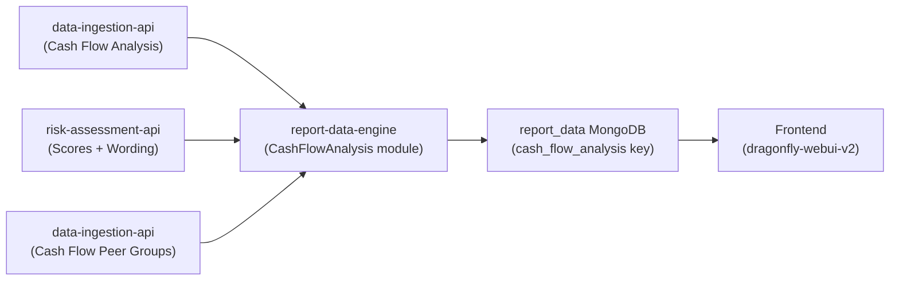

# Cash Flow Analysis Module

## Overview

The `cash_flow_analysis` module in the **report-data-engine** is responsible for aggregating, formatting, and structuring cash flow data from multiple upstream sources into a cohesive, frontend-ready JSON object. This final object is stored within the `report_data` MongoDB collection and consumed by the frontend application (dragonfly-webui-v2) to render the interactive Cash Flow Analysis page.

This module is designed to mirror the architectural patterns established by the Earnings Quality V2 module, ensuring consistency in data processing and component rendering.

## Architecture and Data Flow

The following Mermaid diagram illustrates the data ingestion and processing pipeline for the Cash Flow Analysis module:



### Upstream Sources

The `report-data-engine` integrates data from three primary sources:

1.  **`data-ingestion-api` (Raw Cash Flow Data)**
    *   **Source:** `raw_data_collection["Cash Flow Analysis"]`
    *   **Contents:** Provides period-by-period financial data, including `statutory_cash_flow` (raw line items), `summary_cash_flow` (aggregated/calculated groupings), `calculated_fields` (e.g., FCF Conversion, Free Cash Flow), and `materiality_data`.

2.  **`risk-assessment-api` (Scores and Narrative)**
    *   **Source:** `raw_data_collection["Cash Flow Risk Assessment"]`
    *   **Contents:** Provides algorithmic assessments, including `Scores` (e.g., FCF Conversion Score, Item Persistence Score) and structured `Wording` (Narrative summaries, Persistence Risks, and Incremental Risks).

3.  **`data-ingestion-api` (Peer Group Analytics)**
    *   **Source:** `cash_flow_peer_group` collection
    *   **Contents:** Provides aggregated peer averages for metrics like FCF Conversion, segmented by region, sector, and time period.

## Module Structure

The package is strategically divided into specialized processing components, orchestrated by a central class.

### 1. Orchestrator (`process_cf_modules.py`)

The `CashFlowAnalysisFlags` class serves as the main orchestrator for this pipeline.
*   **Initialization:** It is instantiated constructed with all necessary raw data fetched from MongoDB (company data, risks, peers).
*   **Execution:** The `process_cash_flow_data()` method sequentially executes individual sub-modules.
*   **Merge:** It merges the output of each sub-module into a single `final_data` dictionary.

### 2. Chart Data Processor (`cf_modules/cash_flow_charts.py`)

The `CashFlowCharts` class is responsible for structuring time-series data for the top-half frontend charts.
*   **Metric Extraction:** It extracts primary metrics like `FCF Conversion`, `Adjusted Net Income`, and `Free Cash Flow` from the `calculated_fields`.
*   **Period Grouping:** It intelligently groups periods into standardized buckets: `ttm` (Rolling 12-month), `quarterly`, and `fy` (Fiscal Year).
*   **Peer Integration:** It maps the corresponding peer averages from `cf_peers_data` to the respective company periods, allowing the frontend to overlay peer comparison lines.

### 3. Table Data Processor (`cf_modules/cash_flow_tables.py`)

The `CashFlowTables` class processes the dual-table structures required by the UI.
*   **Summary Table Configuration:** It iterates through `summary_cash_flow` dictionaries, structuring them into an ordered list of items (`header`, `item`, or `total`). It dynamically evaluates inclusion rules (e.g., "Where Material Only" against the period's materiality threshold) and embeds `breakdown` arrays for drill-down functionality.
*   **Statutory Data Passthrough:** It formats the `statutory_cash_flow` arrays. Thanks to upstream enhancements in the data-ingestion-api, this data arrives as a flat, unaggregated list of raw XBRL facts, pre-sorted by sequential categories (Operating, Investing, Financing, Supplemental).
*   **Period Indexing:** It catalogues all available `ttm`, `quarterly`, and `fy` period keys to populate the frontend table period selector dropdowns.

### 4. Risk Data Processor (`cf_modules/cash_flow_risks.py`)

The `CashFlowRisks` class restructures qualitative risk assessments for the "Risks" tab.
*   **Score Mapping:** Maps quantitative scores (from `Scores`) into a normalized frontend structure (e.g., translating `fcfConversionScore`, `finalScore`, and conceptual `riskLevel`).
*   **Narrative Extraction:** Pulls the high-level `Narrative` paragraph.
*   **Risk Cataloging:** Formats the arrays of `Persistence Risks` and `Incremental Risks` into distinct objects for rendering custom warning components.

## Output Schema (report_data)

The culmination of this processing is a structured JSON appended to the company's document in the `report_data` collection under the `cash_flow_analysis` key:

```json
{
  "cash_flow_analysis": {
    "sectionSummary": {
      "score": 5,
      "cashFlowText": "...",
      "filingDetails": { "lastFiling": "Q3 25", "lastFilingDate": "..." }
    },
    "chartData": {
      "fcf_conversion": { "ttm": {...}, "quarterly": {...}, "fy": {...} },
      "adj_ni_vs_fcf": { "ttm": {...}, "quarterly": {...}, "fy": {...} }
    },
    "peerData": {
      "ttm": {...}, "quarterly": {...}, "fy": {...}
    },
    "tables": {
      "summary": { "2025-TTM-Q3": { "items": [...] } },
      "statutory": { "2025-TTM-Q3": { "items": [...] } }
    },
    "availablePeriods": {
      "ttm": ["2025-TTM-Q3", ...],
      "quarterly": ["2025-Q3", ...],
      "fy": ["2024-FY", ...]
    },
    "risks": {
      "scores": { "finalScore": 10, ... },
      "narrative": "...",
      "persistenceRisks": [...],
      "incrementalRisks": [...]
    },
    "pages_info": [["sectionSummary", "cashFlowAnalysis"]]
  }
}
```

## Related Integration Points

*   **`process_report_data.py`**: The entry point that fetches the `cash_flow_peer_group` data and invokes `CashFlowAnalysisFlags`.
*   **`utils.py` (`map_risk_flags`)**: Maps the high-level FCF Conversion score to the `detailed_risk_flags` index.
*   **`constants.py`**: Defines MongoDB collection references (e.g., `cash_flow_peer_group`).
